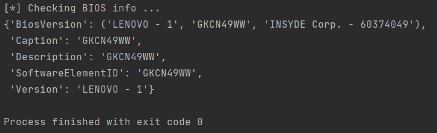
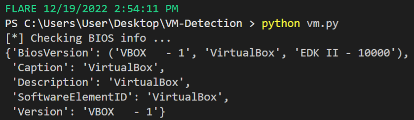
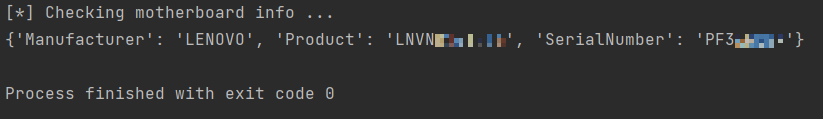
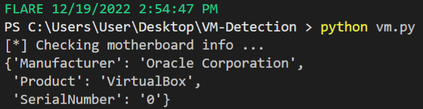

# Analysis of detection methods using hardware checks

## BIOS information 

`check_BIOS()` function queries WMI for information about BIOS. Parameters that can quickly identify a virtual
machine are:
* BiosVersion
* Caption
* Description
* SoftwareElementID
* Version

**Physical machine:**

**Virtual machine:**

## Motherboard information

`check_motherboard()` functions queries WMI for information about computer's motherboard.

**Physical machine:**

**Virtual machine:**

