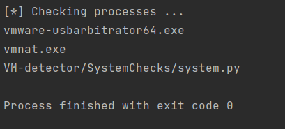
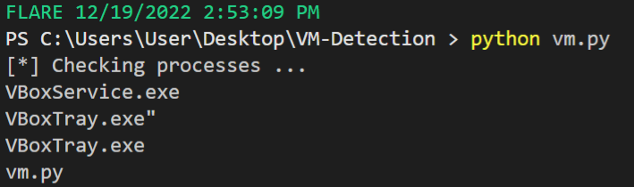
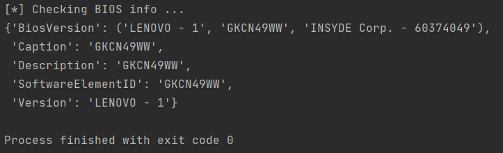
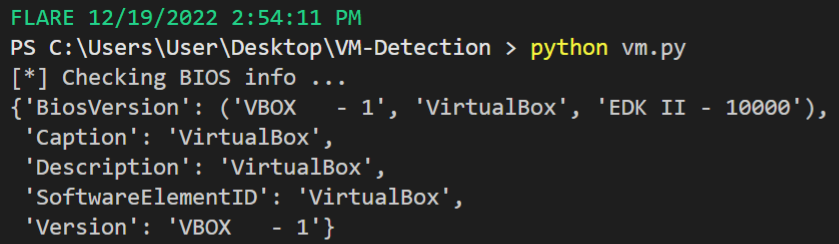
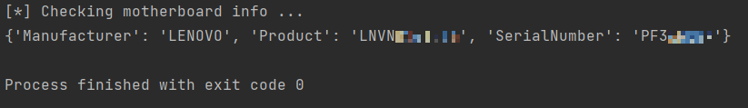
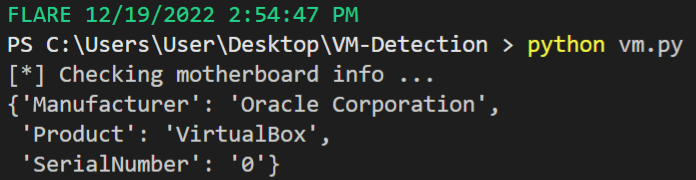
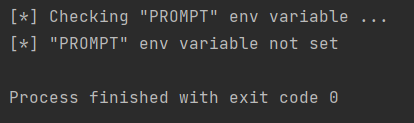
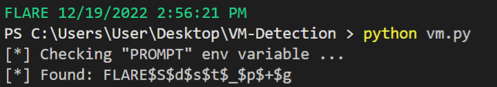

# Analysis of detection methods using system checks

## Running processes

`check_processes()` iterates over all currently running processes and looks for those that contain one of 
the strings specified in `VM_KEYWORDS` file. This methods allows malware to quickly check if any processes
related to virtualization software are currently running on the system.

**Physical machine:**

**Virtual machine:**

Two processes were found running on the system:
* VBoxService.exe 
* VBoxTray.exe 

Both of these executables are related to VirtualBox Guest Additions Service and
indentify the machine as VirtualBox VM.

(_Note that there are VirtualBox processes running on the physical machine as well - 
that is because VirtualBox was running in the background when conducting these tests_)

## BIOS information 

`check_BIOS()` function queries WMI for information about BIOS. Parameters that can quickly identify a virtual
machine are:
* BiosVersion
* Caption
* Description
* SoftwareElementID
* Version

**Physical machine:**

**Virtual machine:**

## Motherboard information

`check_motherboard()` functions queries WMI for information about computer's motherboard.

**Physical machine:**

**Virtual machine:**

Unless changed manually, virtual machine motherboard will reflect its software manufacturer. 
In case of VirtualBox, the manufacturer is `Oracle` and  `SerialNumber` is set to 
0 by deafult.
## Console prompt

Two very popular malware analysis virtual machines are **Flare VM** and **Commando VM**.
Both VMs have been created by cybersecurity firm Mandiant and come with variety of 
tools needed for reverse enginnering and malware analysis. By default, both of them use 
a custom prompt message. The value of the console prompt is set with
environment variable `PROMPT` to a string containing machine name, date and time.
Malware can identify these machines by querying WMI for the 
value of environment variable `PROMPT`.

**Physical machine:**

**Virtual machine:**

